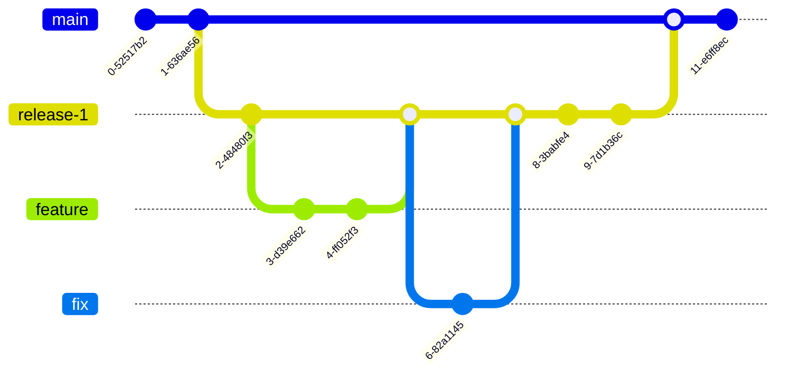

# semantic-basic

Extended semantic-release environment

# Branching strategy

Branching strategy is [Trunk Based Development](https://trunkbaseddevelopment.com/) [short-lived feature branches](https://trunkbaseddevelopment.com/short-lived-feature-branches/):

Notes:

- Use squash and merge strategy (all commits from child branch are squashed into single one) for feature and fix branches to merge into release branch
- Use rebase and merge strategy (all commits from release branch are moved to upstream branch, e.g. like fast-forward merge) for release branches
- Don't create next release branch until current release branch is merged to upstream (otherwise you'll need to rebase next release branch from time to time)  
